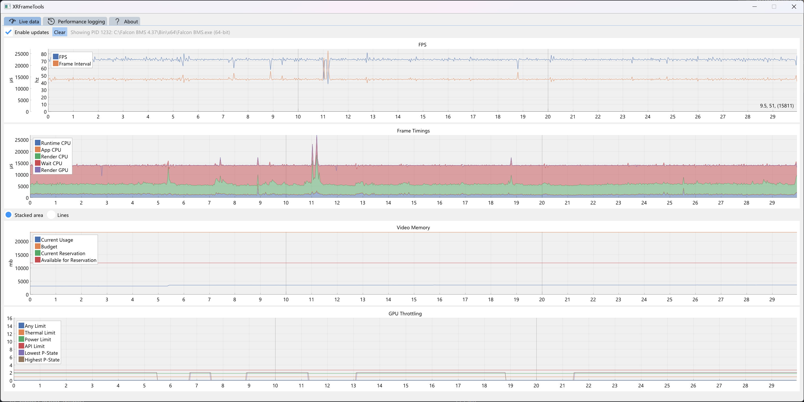

# XRFrameTools

A performance measurement tool for OpenXR on Windows.

**THIS IS AN EARLY ALPHA**

## Features

- Supports 32-bit and 64-bit OpenXR applications
- Supports live display of data
- Supports efficient binary logging, converting to CSV later
    - Logs every frame; you can choose to aggregate when exporting to CSV

## Supported Measurements

- Frame rate and frame interval
- Runtime, app, render, and wait CPU time
- D3D11: Render GPU time, VRAM data
- NVidia: power-save state, throttle reasons

Almost all time measurements will be invalid or incorrect when using 'turbo mode', 'prefer framerate over latency', or
similar tools.

## Got a request?

Check [GitHub issues](https://github.com/fredemmott/XRFrameTools/issues); please:

- don't add a +1 or 'me too' comment: add a thumbs up to the first post in the issue instead
- don't ask for an update or estimate: when there's news it will be added to the issue. There's no need to ask.

## How to use it

1. Download [the latest release](https://github.com/fredemmott/XRFrameTools/releases/latest)
2. Start XRFrameTools from the start menu, desktop, or command line
3. Your live data will appear when an app starts :)

For more detailed analysis, enable the logging, and convert the logs to CSV for use with Google Sheets, Excel, or your
favorite other program.

1. Switch to the 'Performance logging' tab
2. Enable the logging; if you don't select a time period, logging will be enabled for all OpenXR apps until you turn it
   off, even if the XRFrameTools program isn't running
3. Once the game has cloesd or you've disabled logging, click 'Convert log files to CSV...'

As of v0.0.2, logging uses 104 bytes per frame of your hard drive or SSD; this is:

- 26mb/hour at 72fps
- 43mb/hour at 120fps

## How do I make my game faster?

Ask in the games forums, subreddit, Discord, or your favorite other place relevant to the game.

Steps vary widely between systems and games, and I am unable to provide any help with any specific games or hardware.

## What do the numbers mean?

There are 1000 microsecond (*µs*) in 1 millisecond (*ms*), and 1000 milliseconds in 1 second, so there are 1,000,000
microseconds per second.

- FPS: frames per second
- Frame interval: time between each frame, in microseconds (*µs*). The FPS is 1,000,000 divided by the average frame
  interval
- Wait CPU: the amount of time the CPU spends waiting for the best time to start the next frame, to line up with the
  next display refresh
- Render CPU: the amount of time the CPU spends producing work for the GPU
- Runtime CPU: the amount of time the CPU spends in the OpenXR runtime, excluding Wait CPU
- App CPU: the amount of time spent waiting for the game, excluding Render CPU
- Render GPU: the amount of time the GPU spent working on the work the CPU submitting during "Render CPU"

In multi-threaded apps, the 'App CPU' may not include all the CPU time spent on each frame; it only includes the amount
of time that submitting frames to the headset is blocked by the app.

### Video memory

- Current Usage: the amount of VRAM used by the game
- Budget: an upper limit for the amount of VRAM that Windows has provided; if this is less than the Current Usage, you
  should expect crashes and other issues
- Current reservation: the amount of VRAM the game has reserved
- Available for Reservation: the maximum amount of VRAM the game could reserve. The current reservation is included in
  this number

### GPU Throttling (NVIDIA-only)

Indicates the GPU's power state, and any reasons for it entering the power state.

- Any Limit: the GPU is being throttled for any reason
- Lowest P-State: the lowest power-save state the GPU has entered
- Highest P-State: the highest power-save state the GPU has entered
- Thermal limit: the GPU is too hot
- Power limit: one of the following:
    - the GPU is limited by the current performance plan
    - the GPU is limited because the computer is running from battery power
    - the GPU is drawing an unsafe amount of power
    - one or more of the GPU's power connectors are not connected to the PSU
- API limit: the GPU's performance has been limited by the game, or via the NVIDIA Control Panel or third-party tool
- GPU API (CSV only): the API used to retrieve GPU information. This is `"NVAPI"` for NVIDIA cards, or empty if data is
  not available
- GPU limit bits (CSV only): the raw reasons for throttling, as provided by `NVAPI`
    - if 0, no throttling is occurring
    - if any other value, throttling is occurring
    - when "GPU API" is "NVAPI", this value is a bitmask of [
      `NVAPI_GPU_PERF_DECREASE` values](https://github.com/NVIDIA/nvapi/blob/67af97007f59c248c01e520d8c8fb70e243a3240/nvapi.h#L4723)

P-State 0 has no power saving, while P-State 15 has the most power saving; that is, P-State 0 is best performance,
P-State 15 is worst performance.

NVIDIA describe their P-states as:

- P0/P1: maximum 3D performance
- P2/P3: balanced
- P8: basic HD video playback
- P10: DVD playback
- P12: minimum idle power consumption

P states higher than 12 should not be reachable while the PC as a whole is not in a sleep state.

Being in a high P-state is not necessarily a bottleneck if it has been reached due to low GPU load; it is a problem if
it has been reached due to power or thermal limits. If your card is rapidly flicking between various P-states, you may
want to change your NVIDIA/Windows performance profile to 'high performance', as this can introduce stutters.

## Warning about misleading numbers

Your CPU and GPU can be throttled for various reasons, including:

- power saving
- thermal limits
- power consumption limits

If your resource is throttled for thermal or power consumption reasons, you should lower your settings.

If you're throttled for power saving, *this does not affect your overall framerate* but may affect framerate stability.

For example, say you're aiming for 72hz; this means that a frame should be ready every 13.9ms (1000/72).

If your "Render GPU" time is 13.5ms, it may seem like you are limited by your GPU - however, if you have *plenty* of
spare capacity, the GPU may have underclocked itself as it's full performance is just not needed.

13.5ms on a 4090 running at 2,234mhz indicates a problem; 13.5ms on a 4090 running at 250mhz does not indicate a problem
itself - it depends on *why* the GPU is running at 250mhz.

XRFrameTools supports showing throttling reasons for NVIDIA graphics cards; for CPUs and other graphics cards, you
should combine the data with data from tools like HWMonitor or HWInfo64.

## What are the API layers?

XRFrameTools uses several API layers, so that if an incompatibility arises, you can disable just the part that causes
problems.

- `XR_APILAYER_FREDEMMOTT_core_metrics`: FPS, CPU frame timings
- `XR_APILAYER_FREDEMMOTT_d3d11_metrics`: GPU frame timings and VRAM information for D3D11 games
    - requires `core_metrics`
- `XR_APILAYER_FREDEMMOTT_nvapi_metrics`: Additional information for NVIDIA GPUs
    - requires `core_metrics` and `d3d11_metrics`

## Why should I use this instead of OpenXR Toolkit?

OpenXR toolkit is unsupported, and causes crashes and other issues with some modern games.

## Why should I use this instead of my favorite tool for non-VR games?

For OpenXR apps, only use tools that are specifically designed and advertised as supporting OpenXR.

Other tools are primarily based on measuring how frequently the game sends data to your monitor - this does not work
correctly for OpenXR games:

- at best, it will measure the FPS of your games' mirror window rather than the headset FPS
    - even when this is doesn't affect VR, the measured CPU time will include 'Wait CPU' time, when it should be
      excluded; 'Wait CPU' can *only* be accurately measured by tools built for OpenXR.
- at worst, it will cap your headset to your monitor refresh rate, and the game will use your monitors frame timing for
  VR as well

## Should I use this instead of the tools included in the game or my headsets softawre?

Maybe - try both and see which gives you more meaningful data.

It is possible for games and runtimes to use their internal data to provide better data than this tool can; some games
and runtimes do, some don't.